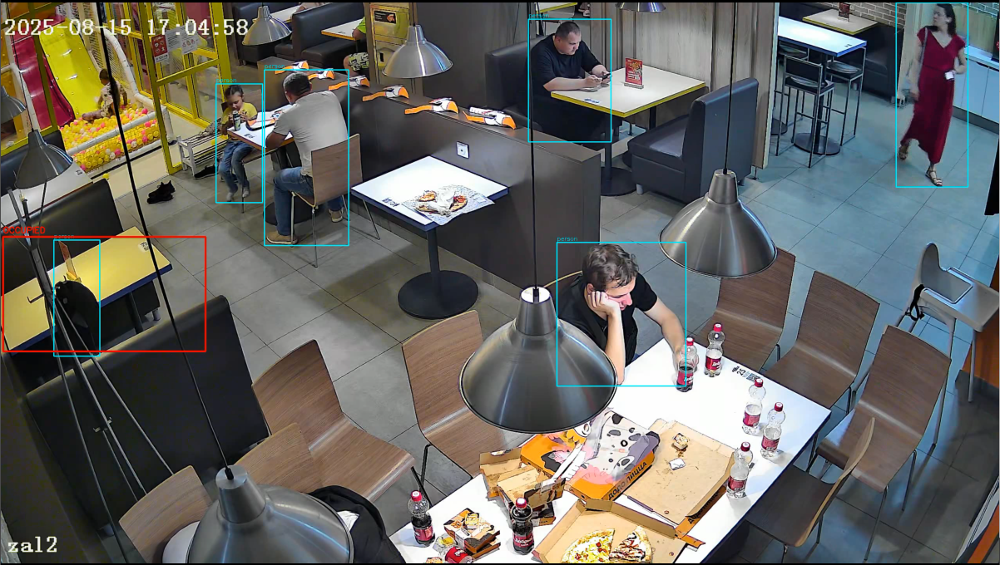

# Прототип системы детекции уборки столиков по видео

## Как запустить

```bash
# 1. Установить зависимости
pip install -r requirements.txt

# 2. Запустить скрипт
python main.py --video video1.mp4
```

При запуске откроется первый кадр видео — выделите мышью зону столика и нажмите ENTER. Скрипт обработает видео и сохранит результат в `output.mp4`(Можно указать место сохранения через --output).
```bash
python main.py --video video1.mp4 --output output/output3.mp4
```

Также можно задать координаты столика вручную:

```bash
python main.py --video video1.mp4 --output output/output3.mp4 --roi 350,180,220,250
```

## Какое видео и какой столик были выбраны

Использовано видео `video1.mp4` — запись камеры наблюдения в зале ресторана.

Выбран столик в левой части кадра (у стеклянной перегородки) — он хорошо виден, периодически освобождается и занимается новыми гостями.

ROI столика: `x=350, y=180, w=220, h=250` *(пример — подставьте свои координаты после выбора)*.

## Логика детекции событий

### Пайплайн

```
Кадр видео → Детекция людей → Проверка пересечения с зоной столика →
→ Машина состояний → Запись событий → Визуализация
```

### Детекция людей

**Метод - YOLO8m** (предобученная модель на COCO, класс `person`, порог уверенности 0.3).

### Определение занятости столика

Для каждого обнаруженного человека вычисляется доля пересечения его bounding box с зоной столика. Если пересечение ≥ 25% площади bbox человека он считается «у столика».

### Три состояния

| Состояние | Цвет рамки | Условие |
|-----------|------------|---------|
| EMPTY     | Зелёный    | Людей в зоне нет |
| OCCUPIED  | Красный    | Есть человек в зоне |
| APPROACH  | Оранжевый  | Момент перехода EMPTY в OCCUPIED |

### Защита от мерцания

Состояние меняется только после 5 последовательных кадров с одинаковым результатом (гистерезис). Если YOLO потеряла человека на 1–4 кадра и снова нашла — состояние не меняется.

### Аналитика

Все события записываются в Pandas DataFrame с временными метками. Для каждого события EMPTY рассчитывается время до ближайшего APPROACH.

## Полученный результат

*(Подставьте реальные числа после запуска на вашем видео)*

  Всего событий: 24
    EMPTY:    8
    APPROACH: 8
    OCCUPIED: 8

  Среднее время между уходом гостя
  и подходом следующего: 118.4 сек
  Мин: 1.5 сек | Макс: 320.9 сек

## Пример проблемного кадра



**Проблема:** Модель ложно задетектила человка на несколько кадров. 

**Выходное видео**
https://disk.yandex.ru/d/TvE8URx7qvJaRA